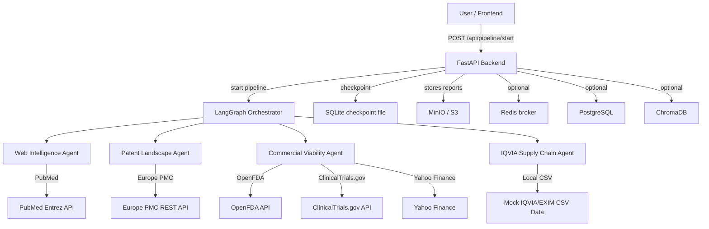

# AgentRX

## Overview

AgentRX is a MedTech / Agentic-AI platform for accelerating pharmaceutical drug repurposing discovery. It orchestrates autonomous worker agents, manages stateful multi-step pipelines, and produces structured decision outputs rather than chat-based responses.

The current repository contains a backend-first implementation with:
- FastAPI for API endpoints
- LangGraph for stateful orchestration
- Celery / Redis for async task handling
- Local mock enterprise data for IQVIA and EXIM analysis
- A resumable pipeline with human approval pause points

----

## Architecture



---

## Repo Structure

```text
AgentRX/
├── backend/
│   ├── app/
│   │   ├── agents/          # Worker agents and business logic
│   │   ├── api/             # FastAPI route definitions
│   │   ├── core/            # Configuration, Celery setup
│   │   ├── pipeline/        # LangGraph workflow and state definitions
│   │   ├── models/          # Pydantic models and DB models (planned)
│   │   └── services/        # External API clients and helpers
│   └── templates/           # Jinja2 report templates
├── config/                  # Pipeline/config metadata
├── data/                    # Persistent data, mock CSVs
├── frontend/                # Frontend integration placeholders
├── infrastructure/          # Docker and deployment assets
├── mock__db_services/       # Local mock API services
│   ├── exim/
│   └── iqvia/
├── requirements.txt
├── docker-compose.yml
├── .env.example
├── context.md
└── README.md
```

---

## Current System Capabilities

### 1. Pipeline Orchestration

The backend exposes a resumable decision pipeline via:
- `POST /api/pipeline/start`
- `POST /api/pipeline/resume`

The pipeline currently executes:
1. **Pharmacodynamic Mapping** via the Web Intelligence Agent
2. **Data Merge** into `merged_diseases`
3. **IP Whitespace Clearance** via the Patent Landscape Agent
4. **Commercial Viability Analysis** via the Commercial Viability Agent
5. **IQVIA / EXIM Supply Chain Analysis** via the IQVIA Supply Chain Agent

A manual approval pause occurs before the commercial viability phase.

### 2. Agent Implementations

| Agent | Role | Data Sources | Current Status |
|---|---|---|---|
| Web Intelligence Agent | Extracts alternative indications from literature | PubMed Entrez + Gemini LLM | Implemented |
| Patent Landscape Agent | Filters by active patents / FTO | Europe PMC | Implemented |
| Commercial Viability Agent | Estimates TAM, competition, trial complexity | OpenFDA, ClinicalTrials.gov, Yahoo Finance, OpenRouter LLM | Implemented |
| IQVIA Supply Chain Agent | Reads local IQVIA / EXIM CSV data, builds supply chain output | Local mock CSVs | Implemented |

---

## How to Run Locally

### Prerequisites

- Python 3.11+ (recommended)
- Docker / Docker Compose
- Git

### Setup

1. Create a virtual environment:
```bash
python -m venv .venv
source .venv/Scripts/activate    # Windows
source .venv/bin/activate        # macOS/Linux
```

2. Install dependencies:
```bash
pip install -r requirements.txt
```

3. Copy environment variables:
```bash
cp .env.example .env
```

4. Update `.env` with your API keys and service endpoints.

### Run services with Docker Compose

```bash
docker-compose up -d
```

The compose stack includes:
- `postgres` for persistent relational storage
- `redis` for Celery broker/backend
- `chromadb` for vector storage
- `minio` for report storage

### Start the Backend

```bash
cd backend
uvicorn app.main:app --reload
```

### Run the Pipeline

Use the `/api/pipeline/start` endpoint to begin and `/api/pipeline/resume` to continue paused runs.

---

## API Endpoints

### POST /api/pipeline/start

Starts the pipeline for a molecule.

**Request**
```json
{
  "molecule": "Metformin"
}
```

**Success Response**
```json
{
  "status": "PAUSED_FOR_HUMAN",
  "thread_id": "<uuid>",
  "message": "Awaiting human approval for IP-cleared candidates.",
  "pending_candidates": []
}
```

### POST /api/pipeline/resume

Resumes a paused pipeline run.

**Request**
```json
{
  "thread_id": "<uuid>"
}
```

**Success Response**
```json
{
  "status": "COMPLETED",
  "molecule": "Metformin",
  "final_candidates": [],
  "iqvia_exim_analysis": {}
}
```

### GET /health

Health check endpoint for the backend.

**Response**
```json
{
  "status": "online",
  "environment": "development",
  "orchestrator": "LangGraph Ready",
  "message": "AgentRX Neural Backend is operational"
}
```

---

## Data & Mock Services

### Mock Services

The repository includes local mock services for enterprise data:
- `mock__db_services/iqvia/` — mock IQVIA market-insights API
- `mock__db_services/exim/` — placeholder for EXIM trade data services

### Local CSV Data

Key mock data files are stored in `data/mock_seeds/`:
- `IQVIA_DrugProfiles.csv`
- `IQVIA_Sales.csv`
- `IQVIA_ClinicalPipeline.csv`
- `EXIM_CountryMatrix.csv`
- `EXIM_TradeData.csv`

These files are consumed by the IQVIA Supply Chain Agent to produce supply chain summaries.

---

## Configuration

The backend uses `app/core/config.py` to load environment variables from `.env`.
Important config keys include:
- `POSTGRES_URL`
- `REDIS_URL`
- `CHROMADB_HOST`
- `CHROMADB_PORT`
- `NEO4J_URI`
- `GOOGLE_API_KEY`
- `OPENROUTER_API_KEY`
- `S3_ENDPOINT_URL`
- `AWS_ACCESS_KEY_ID`
- `AWS_SECRET_ACCESS_KEY`

---

## Known Limitations

- Frontend is not implemented in this repository; the `frontend/` folder is a placeholder.
- PostgreSQL and Neo4j integrations are referenced in config, but the current pipeline uses SQLite checkpoints for runtime state.
- RAG vector search and Neo4j knowledge graph features are planned, not yet wired into the current flow.
- Some external API calls are mocked or dependent on available API keys.

---

## Development Notes

- The pipeline is defined in `backend/app/pipeline/graph.py` using LangGraph state nodes.
- Worker agent logic lives in `backend/app/agents/workers.py`.
- The pipeline REST API lives in `backend/app/api/routes/pipeline.py`.
- `backend/app/core/celery_app.py` configures Celery, but task modules are minimal.

---

## Contribution

1. Fork the repo
2. Create a feature branch
3. Run the backend locally and test changes
4. Submit a PR with clear architectural notes

----
## Contact

For this repository, use the internal `context.md` as the source of truth for architecture, current implementation state, and feature planning.
